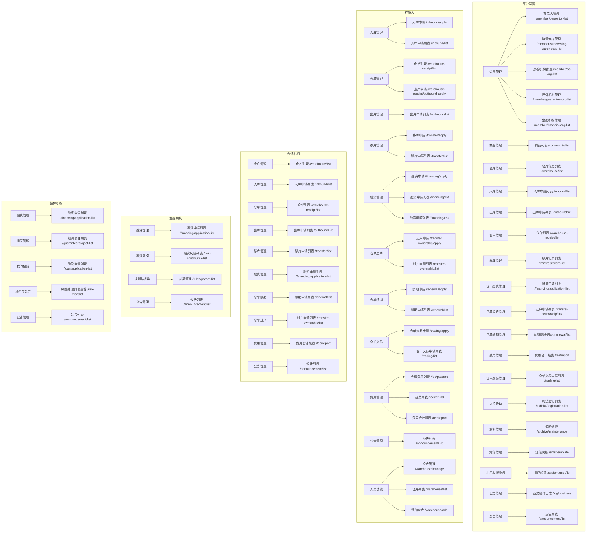

# 路由树（按角色展示）

> 说明：仅展示侧栏显性入口，带 :id 的详情/编辑路由不显示在侧栏。

```mermaid
flowchart TD
  subgraph Operation[平台运营]
    M1[会员管理]
    M1 --> MD1[存货人管理 /member/depositor-list]
    M1 --> MD2[监管仓库管理 /member/supervising-warehouse-list]
    M1 --> MD3[质检机构管理 /member/qc-org-list]
    M1 --> MD4[担保机构管理 /member/guarantee-org-list]
    M1 --> MD5[金融机构管理 /member/financial-org-list]

    M2[商品管理]
    M2 --> P1[商品列表 /commodity/list]

    M3[仓库管理]
    M3 --> W1[仓库信息列表 /warehouse/list]

    M4[入库管理]
    M4 --> I1[入库申请列表 /inbound/list]

    M5[出库管理]
    M5 --> O1[出库申请列表 /outbound/list]

    M6[仓单管理]
    M6 --> WR1[仓单列表 /warehouse-receipt/list]

    M7[移库管理]
    M7 --> T1[移库记录列表 /transfer/record-list]

    M8[仓单融资管理]
    M8 --> F1[融资申请列表 /financing/application-list]

    M9[仓单过户管理]
    M9 --> TO1[过户申请列表 /transfer-ownership/list]

    M10[仓单续期管理]
    M10 --> R1[续期信息列表 /renewal/list]

    M11[费用管理]
    M11 --> FE1[费用合计报表 /fee/report]

    M12[仓单交易管理]
    M12 --> TR1[仓单交易申请列表 /trading/list]

    M13[司法协助]
    M13 --> J1[司法登记列表 /judicial/registration-list]

    M14[资料管理]
    M14 --> A1[资料维护 /archive/maintenance]

    M15[短信管理]
    M15 --> S1[短信模板 /sms/template]

    M16[用户权限管理]
    M16 --> U1[用户设置 /system/user/list]

    M17[日志管理]
    M17 --> L1[业务操作日志 /log/business]

    M18[公告管理]
    M18 --> AN1[公告列表 /announcement/list]
  end

  subgraph Inventory[存货人]
    IM1[入库管理]
    IM1 --> II1[入库申请 /inbound/apply]
    IM1 --> II2[入库申请列表 /inbound/list]

    IM2[仓单管理]
    IM2 --> IW1[仓单列表 /warehouse-receipt/list]
    IM2 --> IW2[出库申请 /warehouse-receipt/outbound-apply]

    IM3[出库管理]
    IM3 --> IO1[出库申请列表 /outbound/list]

    IM4[移库管理]
    IM4 --> IT1[移库申请 /transfer/apply]
    IM4 --> IT2[移库申请列表 /transfer/list]

    IM5[融资管理]
    IM5 --> IF1[融资申请 /financing/apply]
    IM5 --> IF2[融资申请列表 /financing/list]
    IM5 --> IF3[融资风险列表 /financing/risk]

    IM6[仓单过户]
    IM6 --> IT11[过户申请 /transfer-ownership/apply]
    IM6 --> IT12[过户申请列表 /transfer-ownership/list]

    IM7[仓单续期]
    IM7 --> IR1[续期申请 /renewal/apply]
    IM7 --> IR2[续期申请列表 /renewal/list]

    IM8[仓单交易]
    IM8 --> IT21[仓单交易申请 /trading/apply]
    IM8 --> IT22[仓单交易申请列表 /trading/list]

    IM9[费用管理]
    IM9 --> IF21[应缴费用列表 /fee/payable]
    IM9 --> IF22[退费列表 /fee/refund]
    IM9 --> IF23[费用合计报表 /fee/report]

    IM10[公告管理]
    IM10 --> IAN1[公告列表 /announcement/list]

    IM11[人员功能]
    IM11 --> IW21[仓库管理 /warehouse/manage]
    IM11 --> IW22[仓库列表 /warehouse/list]
    IM11 --> IW23[添加仓库 /warehouse/add]
  end

  subgraph Warehouse[仓储机构]
    WM1[仓库管理] --> WX1[仓库列表 /warehouse/list]
    WM2[入库管理] --> WX2[入库申请列表 /inbound/list]
    WM3[仓单管理] --> WX3[仓单列表 /warehouse-receipt/list]
    WM4[出库管理] --> WX4[出库申请列表 /outbound/list]
    WM5[移库管理] --> WX5[移库申请列表 /transfer/list]
    WM6[融资管理] --> WX6[融资申请列表 /financing/application-list]
    WM7[仓单续期] --> WX7[续期申请列表 /renewal/list]
    WM8[仓单过户] --> WX8[过户申请列表 /transfer-ownership/list]
    WM9[费用管理] --> WX9[费用合计报表 /fee/report]
    WM10[公告管理] --> WX10[公告列表 /announcement/list]
  end

  subgraph Financial[金融机构]
    FM1[融资管理] --> FF1[融资申请列表 /financing/application-list]
    FM2[融资风控] --> FF2[融资风险列表 /risk-control/risk-list]
    FM3[规则与参数] --> FF3[参数管理 /rules/param-list]
    FM4[公告管理] --> FF4[公告列表 /announcement/list]
  end

  subgraph Guarantee[担保机构]
    GM1[融资管理] --> GF1[融资申请列表 /financing/application-list]
    GM2[担保管理] --> GF2[担保项目列表 /guarantee/project-list]
    GM3[我的借贷] --> GF3[借贷申请列表 /loan/application-list]
    GM4[风控与公告] --> GF4[风险处理列表查看 /risk-view/list]
    GM5[公告管理] --> GF5[公告列表 /announcement/list]
  end
```
